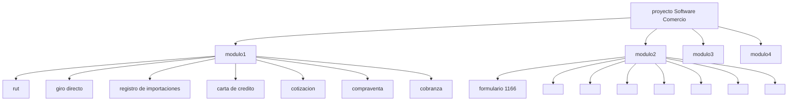

# mapa v1

## Modulo 1
- [x] Mensajeria Swift
## rut
- todo
  - [x] hacer frontend
  - [x] hacer css
  - [x] modificar bases de datos   por csv
  - [x] numeros de las celdas
  - [ ] codigo del pais, ciudad, departamento y admnistracion, codigo de documento vinculados con el codigo
  - [x] tipo de usuario
  - [x] falta terminar formulario
  - [ ] dar paso a importaciones
  - [x] formatos de fecha a "YYYY-MM-DD"
  - [ ] Campo 53 18 campos tipo text de dos valores por campo
  - [ ] Campo 54 10 campos de desplegables
  - [ ] Organizar campos
  - [ ] Separar seccion exportadores
  - [ ] 57 servicios con checkbox
  - [ ] 58 campo para dos caracteres numericos 

### frontend
  - [x] div
  - [ ] campos obligatorios

## giro directo (Linares)
- todo
    - [x] poner requeridos
    - [x] cargar select de ciudades y paises
    - [x] firma debe llevar examinar
    - [x] 2da moneda sea opcional
    - [x] formatos de fecha a "YYYY-MM-DD"

## registro de importaciones
- todo
   - [x] falta re-aplicar bootstrap
   - [x] cambiar titulo
    - [x] hacer index.html
    - [x] falta aplicar css
    - [x] hacer backend
    - [x] formatos de fecha a "YYYY-MM-DD"
    - [x] desplegables
      - [x] clase de importador
      - [x] desplegable
      - [x] aduana
      - [x] via
      - [x] visto bueno
      - [x] posicion arancelaria
      - [x] unidad comercial
      - [x] C
    - [ ] actividad de importador  viene del RUT
    - [x] condicion de reembolsable/no reembolsable
    - [x] tasa de cambio, valor total  a float con dos decimales
    - [x] anexos poner un input type file para pdf's
    - [ ] si en la casilla 10 libre queda con REG, si es previa LIC
    - [x] hablar con stiven para hacer el consecutivo en js
    - [ ] crear un sub formulario 
    - [x] desahbiltar direccion telefon ciudad 
    - [x] ampliar tamaño del 12
    - [x] cambiar el campo 26(parsear float)
    - [x] ponerle bootstrap
    - [ ] operaciones en valores totales 
    - [ ] condicionar unidad comercial a c
    - [ ] poner border 
    - [ ] Tasa de cambio multiplicado por valor total de la moneda de negociacion y da como resultado el valor total en dolares (campos 23, 24, 25)}
    - [ ] casilla 26 en letras
    - [ ] Agregar search para la casilla 29
    - [ ] Duplicar campos del 37 a 44 (items de subpartida) x2
  
## carta de credito
- todo
    - [x] falta re-aplicar bootstrap
    - [x] hacer backend
    - [x] seleccion CIIU
    - [x] campos obligatorios ( todos menos)
      - [x] otro
      - [x] fax
      - [x] tolerancia
      - [x] dias
      - [x] otro documento
      - [x] banco notificador
      - [x] swift
    - [x] dehabilitar registro de importacion si no es igual a exento
    - [x] si utilizables con pago es igual a mixto habilitar en caso de mixto
    - [ ] volver a hablar con stiven sobre insertar campos en js
    - [x] cambiar descripcion de mercancia por textarea
    - [x] condiciones adicionales a textarea
    - [x] poner en copia original un select
    - [x] formatos de fecha a "YYYY-MM-DD"
  - [x] formatos de fecha a "YYYY-MM-DD"
  - [ ] codificaer en utf8
  - [x] clonar tabla de cobranza
  

## cotizacion
  - [ ] cotizacion deshabilitado para leer desde base de datos
  - [ ] examinar para cargar documentos
  - [x] campos amarillos son selects
  - [ ] insertar el plus
  - [ ] decirle a steven que con js calcule el valor de una vez 
  - [x] hacer q fecha ,ciudad, medio de transporte se vean bonito
  - [x] orden de la tabla de items
  - [ ] arreglar ortografia
  - [ ] cantidad por valor unitario = valor total
  - [ ] suma de todos los valores totales = total
  - [ ] poner fecha, ciudad y medio de transporte en otra fila
  
## compraventas
  - [x] cambiar tosdo lo q diga  solucitu de compraventa por contrato de compraventa
  - [x] copiar lista de monedas donde dice valores en 
  - [x] tabla en responsive
  - [x] flete por float
  - [x] poner firma autrizada debajo de firma autorizada
  - [ ] cantidad por unitario = total
  - [ ] agregar un campo que muestre la suma de todos los totales

## solicitud de cobranzas
  - [ ] utilizar pseudo codigo para poner mayuscula
  - [ ] ampliar campo de fecha
  - [ ] dejar un plus en tabla 
  - [ ] poner un pading soluciones para cargas y ingresos 
  - [ ] seccionar y poner bonito
  - [ ] cambiar select radio buton de si y no
  - [ ] redistribuir
  - [ ] cambiar aplicables por radio buttons
  - [ ] cambiar numero de aceptacion por campo numerico

## solicitud cotizacion
  - [ ] centrar titulos
  - [ ] agregar cpu a terminos
  - [ ] poner en tabla y con el size en porcentaje (menos sub-partida)
  - [ ] redistribuir los campos
